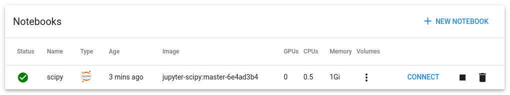

# rhoda-notebook-controller
Recipe for RHODA and Kubeflow Notebook-Controller integration

These instructions assume a basic working knowledge of openshift, jupyter notebooks and RHODA.


## Step 1. Verify your notebook-controller installation.

```shell
oc -n opendatahub get crd/notebooks.kubeflow.org
oc get pods -l app=notebook-controller -n opendatahub
oc get pods -l app=jupyter-web-app -n opendatahub
```

Find the route to your Jupyter web interface, login, create and connect to a notebook.
```shell
oc get route jupyter -n opendatahub
```



After your notebook has been created, find the notebook name. You will need to know your notebook namespace (i.e. kubeflow-user):
```shell
oc -n kubeflow-user get notebooks
```

Output should be something like:
```NAME             AGE
bluebook-small   47h
```

## Step 2. Add your connected database.

This step assumes the DBaaSInventory has been populated. (Admin or developer created instance. See the RHODA admin and developer workflows for more information. https://access.redhat.com/documentation/en-us/red_hat_openshift_database_access/1/html-single/quick_start_guide/index)

Follow the developer workflow for instructions on adding a connected database. Make sure to add the connected database in your notebook namespace.

Get the name of the connectedb:
```shell
oc -n kubeflow-user get dbaasconnection
```
Example output:
```shell
NAME                        AGE
jary-test-0328-ba0d22970f   41h
```

## Step 3.  Setup roles for Service Binding.

Add the following rolebinding:
```yaml
apiVersion: rbac.authorization.k8s.io/v1
kind: ClusterRoleBinding
metadata:
  name: dbaas-nb-edit
roleRef:
  apiGroup: rbac.authorization.k8s.io
  kind: ClusterRole
  name: notebook-controller-kubeflow-notebooks-edit
subjects:
- kind: ServiceAccount
  name: service-binding-operator
  namespace: redhat-dbaas-operator
```

This allows the sa service-binding-operator to modify the notebook. 

## Step. 4 Create the service binding manually. 

The service binding will be between the dbaasconnection added in step 3 and the notebook (kind:notebook, not the deployment in opendatahub or statefulset) in the notebook namespace.

Use the dbaasconnection name from above in the service binding:

```yaml
apiVersion: binding.operators.coreos.com/v1alpha1
kind: ServiceBinding
metadata:
  name: demo-sb
  namespace: kubeflow-user
spec:
  application:
    group: kubeflow.org
    name: bluebook-small # REPLACE with a notebook from “os get notebook -n kubeflow-user”
    resource: notebooks
    version: v1
  bindAsFiles: true # change to false if you require env vars
  detectBindingResources: true
  services:
  - group: dbaas.redhat.com
    kind: DBaaSConnection
    name: jary-test-0328-ba0d22970f  # REPLACE with name of your dbaasconnection: “oc -n kubeflow-user get dbaasconnection”
    version: v1alpha1
```

## Step 5. Verify the notebook and RHODA integration.

To verify your notebook can use/view the connected database binding, enter your notebook and in a cell run:
```shell
!env
```

In the output, search for "binding". You should see the following:
```shell
'SERVICE_BINDING_ROOT': '/bindings',
```

You may consume this binding by using the pyservicebinding library. 

## Limitations
Each notebook created from the notebook-controller window will require a servicebinding. New notebooks from within a Jupyter window do not require new servicebindings. 
